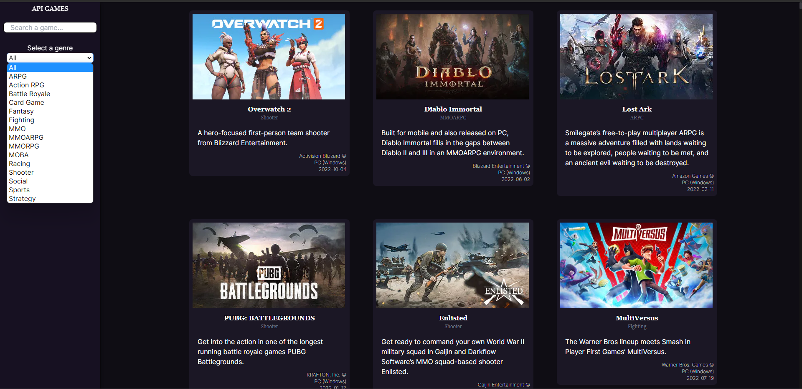
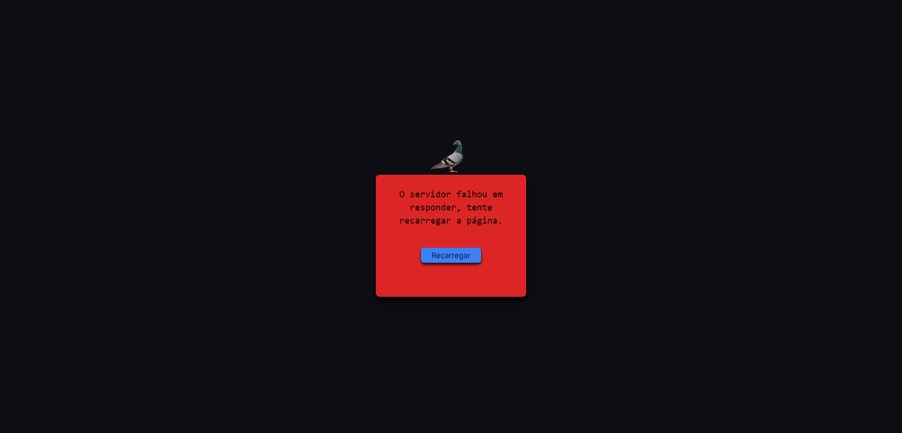
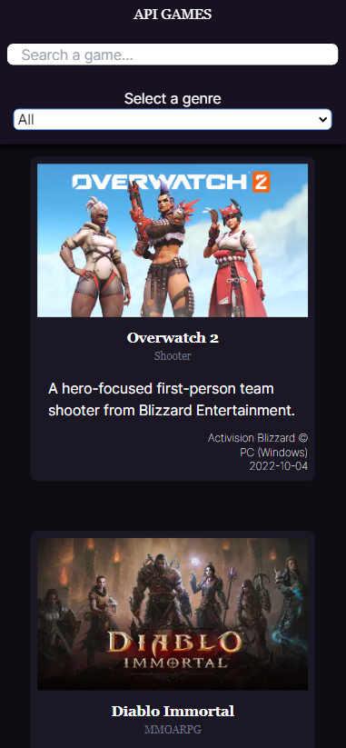

➡️ [Projeto](https://api-games-frontend.vercel.app/)

# Projeto de Estágio Frontend React

#### Tesde de Estágio realizado, onde seria necessário implementar um frontend e apresentar uma lista de jogos, que é fornecida por uma API.

Recebido 24 de jun. de 2023 00:01

Entregue 25 de jun. de 2023 03:00

### Requisitos

- O projeto deve ser feito usando React ou Next.JS
- Obter a lista de jogos em `/data`
- Apresentar um loader enquanto os dados são obtidos
- Apresentar os jogos em três colunas (no computador)
- Em cada card apresentar o título e imagem pelo ao menos
- Lidar com a responsividade, para que fique bem apresentado no computador, tablets ou celular
- Quando a API retornar o `status code` 500, 502, 503, 504, 507, 508 ou 509 apresentar ao usuário `O servidor fahou em responder, tente recarregar a página`
- Caso a API retorne outros erros, apresentar `O servidor não conseguirá responder por agora, tente voltar novamente mais tarde`
- Ao realizar uma chamada, não esperar mais que 5 segundos pelo retorno. Se os dados demorarem mais de 5 segundos para retornar apresentar `O servidor demorou para responder, tente mais tarde`
- Sempre que apresentar uma mensagem para o usuário, ou tiver os dados em mãos para apresentar, ocultar o loader
- Incluir um campo de busca, que permite localizar jogos pelo título, com busca case insensitive
- Uma vez que tenha os dados em mãos, veja quais `genre` foram retornados e permita ao usuário selecionar um deles, e então filtre para exibir apenas jogos do gênero selecionado

➡️ [Detalhes do projeto](https://app-masters.notion.site/Projeto-de-Est-gio-Frontend-React-34d8dcade9f74da29e5e1d4f0d6ef737)

## Screenshots

